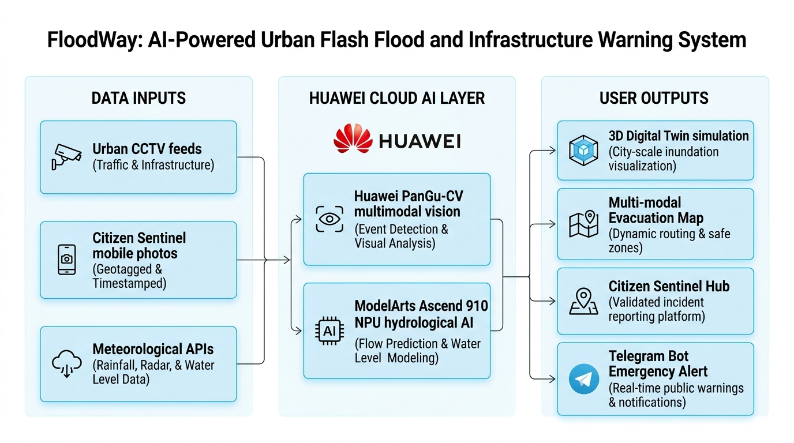

# FloodWay 2.0: AI-Powered Urban Flash Flood & Infrastructure Warning System
### Architecture Specification & Technical Documentation (Zero-IoT & Infrastructure-Centric)
**Huawei ICT Competition 2026 · Innovation Track**

---

## 1. Executive Summary & Paradigm Shift

Traditional flood alert systems were originally built around rural river basins using physical IoT hardware (ultrasonic sensors, GSM telemetry towers, battery arrays). While useful for slow-rising riverine floods over hours or days, **this paradigm fundamentally fails in metropolitan urban environments**:

1. **Urban Flash Flood Dynamics:** Convective tropical downpours in cities like Kuala Lumpur, Shah Alam, and Penang dump massive rainfall (60–100mm/hr) in under 45 minutes, creating flash inundation in low-lying urban nodes within 10 to 15 minutes.
2. **The IoT Scaling Bottleneck:** Deploying, maintaining, and replacing physical sensors across thousands of commercial mall basements, highway underpass dips, and drainage culverts entails massive capital and operational expenses (sensor fouling, silt debris clogging, battery decay, theft, and subterranean cellular dead zones).
3. **The Vision-First Infrastructure Solution:** FloodWay 2.0 pivots to a **Zero-IoT, Vision-First, 100% Cloud-Native architecture**. It ingests existing city surveillance infrastructure—thousands of municipal traffic cameras (DBKL/MBPJ) and private commercial building CCTV streams—paired with geotagged citizen smartphone reports, processing all imagery in real time via **Huawei Cloud PanGu-CV** and **ModelArts Ascend 910 AI**.

---

## 2. High-Level System Architecture Diagram



The system operates across three seamlessly linked columns:

```
[COLUMN 1: DATA INPUTS]               [COLUMN 2: HUAWEI CLOUD AI LAYER]           [COLUMN 3: USER OUTPUTS & INTERFACES]
├── Urban CCTV & Visual Feeds    ──┐  ┌──────────────────────────────────────┐  ──► 3D Digital Twin (/simulation)
├── Citizen Sentinel (Web/Mobile)──┼─►│ 1. Huawei PanGu-CV (Multimodal)      │  ──► Multi-Modal Evacuation Map (/map)
└── Meteorological & Rain APIs   ──┘  │ 2. ModelArts Ascend 910 NPU Engine   │  ──► Citizen Sentinel Hub (/reports)
                                      │ 3. Inundation-Weighted A* Algorithm │  ──► Telegram Emergency Siren & Check-in
                                      └──────────────────────────────────────┘
```

---

## 3. Detailed Architectural Breakdown

### Column 1: Multi-Source Urban Data Ingestion (Zero-IoT)
* **Urban CCTV & Infrastructure Feeds:**
  * Ingests RTSP/HTTPS video feeds from existing municipal street cameras, traffic management command centers (Integrated Transport Information System - ITIS), and commercial underground carpark entry ramp surveillance.
  * Monitors critical choke points: shopping mall basement ramps, sunken highway underpasses, and major river basin discharge gates.
* **Citizen Sentinel (Mobile App & Web PWA):**
  * Real-time crowdsourced hazard reports with GPS coordinates, timestamps, and uploaded field photographs.
  * Allows citizens and field wardens to flag rising curb waters, clogged storm drains, and trapped vehicles.
* **Meteorological & Hydrological Public APIs:**
  * MetMalaysia Doppler Weather Radar (convective rain cells & precipitation intensity).
  * Department of Irrigation and Drainage (DID / JPS InfoBanjir) urban stormwater telemetry.

---

### Column 2: Huawei Cloud Enterprise AI Layer
* **Huawei PanGu-CV (Multimodal Computer Vision):**
  * **Waterline Segmentation & Depth Estimation:** Calibrates flood waterline height against known physical reference objects in urban scenes (car tires, concrete curbs, lamp posts, guard rails).
  * **Visual Authenticity & Anti-Deepfake Verification:** Evaluates uploaded photos for digital manipulation, synthetic generation artifacts (Midjourney/DALL-E), and recycled historical flood imagery to prevent public panic.
* **Huawei ModelArts AI Engine (Ascend 910 NPU Hardware):**
  * **Hydrological Time-Series Inference:** Custom PyTorch Bidirectional GRU deep learning model predicting forward water depths ($h_{t+60}$) and flash accumulation rates ($\Delta h/\Delta t$).
  * **Basement Inundation Forecaster:** Simulates underground water penetration based on surface street runoff rates.
* **FloodWay Inundation-Weighted A\* Routing Engine:**
  * Computes dynamic impedance on urban road networks based on real-time flood severity vectors, automatically closing off submerged roads and routing vehicles safely to designated shelters.

---

### Column 3: User Outputs & Action Interfaces
* **1. 3D Digital Twin Simulation (`/simulation`):**
  * Interactive Three.js spatial simulation of an urban building and underground carpark.
  * Real-time visualization of water ingress, structural risk points, and the critical **110 cm electrical DB board breach threshold**.
* **2. Multi-Modal Evacuation Map (`/map`):**
  * Interactive turn-by-turn routing across Drive, Bike, and Walk modes.
  * Dynamic hazard avoidance rerouting around flooded underpasses.
  * Automated Geofence verification (<50m radius) upon arrival at designated evacuation shelters.
* **3. Citizen Sentinel Reporting Hub (`/reports`):**
  * Community intelligence feed featuring PanGu-CV verified hazard flags.
  * Two-tier clearance: AI instant triage + Human Authority review desk (APM / NADMA).
* **4. Telegram Bot API & Emergency Siren (`@floodway_bot`):**
  * Automated high-priority alerts with direct Google Maps GPS links.
  * Urgent **"Move Vehicles to High Ground"** warning with countdown.
  * Closed-loop **"Safe Shelter Arrival Confirmed"** family check-ins.

---

## 4. Key Target Urban Scenarios

### Scenario A: Shopping Mall Underground Basement Carparks
* **The Threat:** During high-intensity storms, surface stormwater breaches driveway humps and cascades down basement entry ramps (e.g. Mid Valley, Suria KLCC, IOI City Mall). B1 and B2 can flood in under 15 minutes, submerging hundreds of cars and drowning underground high-voltage transformers.
* **The Solution:** PanGu-CV camera detection detects ramp water accumulation early (>15 cm); triggers automated Telegram alerts to vehicle owners to move cars to upper levels, and sends signals to activate automated flood gates.

### Scenario B: Sunken Highway Underpasses & Dips
* **The Threat:** Sunken bypasses on major highways (Federal Highway, NPE, Jalan Tun Razak) turn into instant water basins during flash floods. Motorists enter without realizing the true depth, causing engine hydrolock and multi-kilometer traffic jams that block emergency responders.
* **The Solution:** Traffic CCTV monitors underpass water depth against road markers. When depth breaches 30 cm, the A* routing engine updates instantly, routing approaching drivers onto elevated highway flyovers.

### Scenario C: Critical Infrastructure & Substation Basements
* **The Threat:** Ground-level commercial properties, server rooms, and TNB electrical substations risk catastrophic electrical fires or prolonged blackouts if water breaches the electrical distribution board.
* **The Solution:** The 3D Digital Twin calculates precise rate of rise and enforces the **110 cm Main DB threshold**, initiating safe emergency power cut-off before firefighters enter the scene.

---

## 5. Architectural Benefits over Legacy IoT

| Dimension | Legacy IoT Systems | FloodWay 2.0 (Vision + Cloud Native) |
| :--- | :--- | :--- |
| **Hardware Deployment** | Thousands of ultrasonic sensor nodes | **Zero new hardware** (Uses existing CCTVs) |
| **Coverage in Basements** | Blocked by concrete subterranean dead zones | **High reliability** (Wired IP cameras + Cloud AI) |
| **Maintenance & Opex** | Battery replacements, sensor cleaning, vandalism | **Zero physical field maintenance** |
| **Scalability** | Linear hardware cost per monitored site | **Instant software scale** to entire city grids |
| **Misinformation Prevention** | No visual proof; raw telemetry numbers only | **PanGu-CV photo verification + anti-deepfake screening** |
